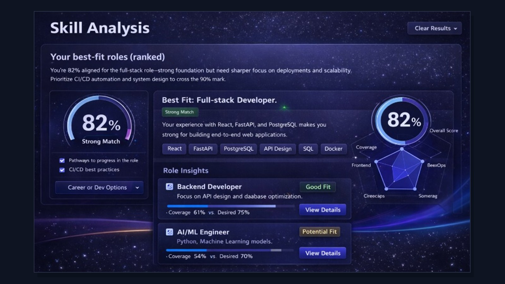
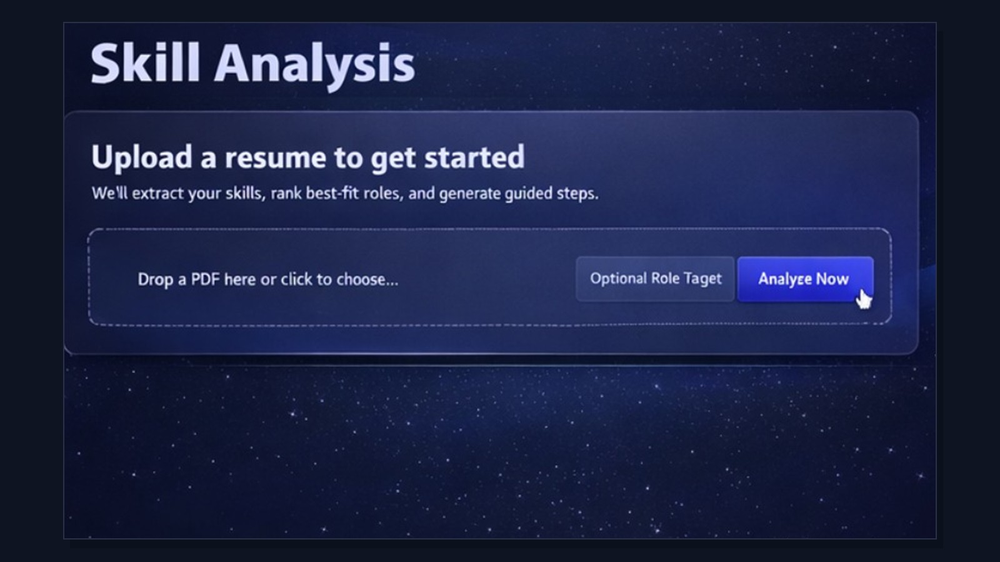
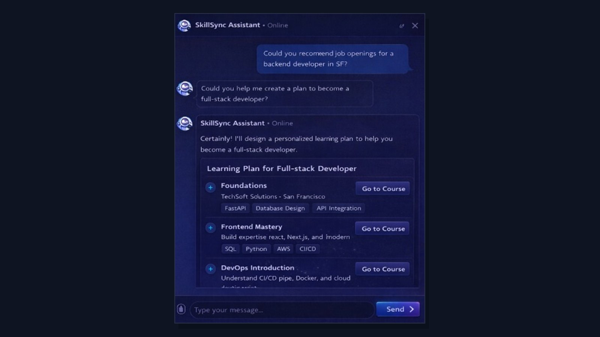
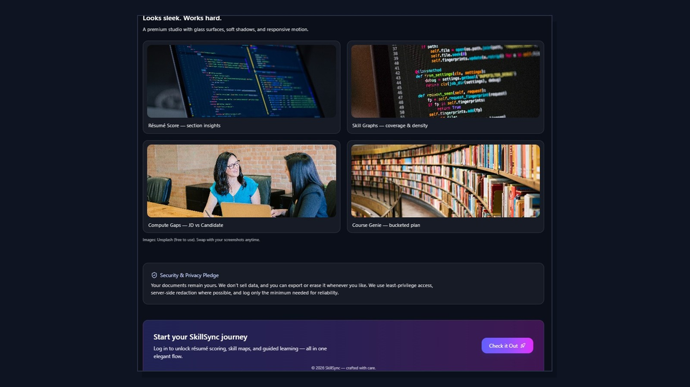

# SkillSync

SkillSync is a full-stack career intelligence platform that treats resumes, job descriptions, and skill signals as computable inputs rather than static documents. The system is designed to help a candidate understand three things with precision: where they currently stand, what roles they are plausibly aligned to, and what concrete capabilities they need to build next.

At the product level, SkillSync unifies resume scoring, skill extraction, role-fit analysis, gap computation, learning-path generation, live job discovery, and assistant-guided planning. At the systems level, it combines deterministic text processing, semantic retrieval, classic machine learning, and LLM-backed reasoning into a single decision-support workflow.

## Platform Scope

- Resume upload and structured profile extraction
- Skill extraction with normalized technical vocabulary
- Resume scoring with interpretable feedback
- Ranked role-fit analysis and overlap reasoning
- Candidate-versus-job gap computation
- Guided learning recommendations and course planning
- Location-aware job discovery and map-based exploration
- Assistant workflows for coaching, planning, and follow-up actions

## Product Views

The interface is organized as a connected workflow rather than a collection of isolated tools. The screenshots below reflect that progression from orientation, to analysis, to decision support.

### Landing and Positioning

<p align="center">
  
</p>

<p align="center">
  
</p>

### Dashboard and Candidate State

<p align="center">
  
</p>

The dashboard acts as an operational view of candidate progress: resume state, workflow momentum, skill pulse, and the next highest-leverage action.

### Skill Analysis Workflow

<p align="center">
  
</p>

This flow moves from document evidence to ranked role-fit analysis. The system extracts skill signals, estimates role alignment, and surfaces a more interpretable best-fit view than a generic resume score alone.

### Gap and Metrics Layer

<p align="center">
  
</p>

The metrics layer focuses on what is absent, weakly evidenced, or only partially represented. It is intended to make the next improvement step explicit rather than implied.

### Job Discovery

<p align="center">
  
</p>

Job exploration is tied back to the candidate profile, allowing the platform to connect role intent, location, and fit-oriented reasoning in a single interface.

### Assistant-Guided Planning

<p align="center">
  
</p>

The assistant layer is designed to convert analysis into action: planning a learning path, clarifying missing skills, and generating targeted next steps.

## AI and ML Architecture

SkillSync is built on a hybrid intelligence model. It does not rely on a single scoring heuristic or a single LLM prompt. Instead, different computational layers are responsible for different forms of reasoning.

### 1. Deterministic Processing

The first stage is intentionally non-generative.

- Resume and JD content are parsed and normalized into stable textual inputs.
- Skill strings are cleaned, canonicalized, and aligned to curated taxonomies.
- Exact overlaps, section signals, and structural indicators are extracted before any generative reasoning is introduced.

This layer makes the system auditable. It ensures that downstream scoring and guidance are anchored to explicit evidence rather than prompt-only interpretation.

### 2. Feature Engineering and Classical ML

The backend contains explicit ranking and scoring infrastructure built on standard ML tooling.

- TF-IDF vectorization is used for text similarity and signal weighting.
- Cosine similarity and overlap statistics are used to compare resumes and role descriptions.
- Hand-engineered features such as skill overlap, jaccard-style coverage, title cues, and profile density are assembled into ranking features.
- `scikit-learn` supports vectorization, similarity, and feature-oriented modeling utilities.
- `XGBoost` is included for model-assisted fit scoring and structured predictive ranking.

This matters because the platform is not merely describing a resume. It is constructing a measurable compatibility surface between candidate evidence and role requirements.

In the current backend, model-oriented scoring is not abstract prose. The feature path explicitly includes signals such as cosine similarity, skill overlap, skill union, skill-jaccard behavior, resume skill count, job skill count, and title-level priors for role families such as SWE and ML. That gives the ranking layer a concrete numerical basis before any narrative explanation is generated.

### 3. Semantic Retrieval

Keyword overlap is not enough for career matching, especially when candidates describe the same capability in inconsistent ways. To reduce that brittleness, SkillSync includes semantic retrieval components.

- Sentence-transformer embeddings are used to represent skills, roles, and catalog items in vector space.
- Role and skill catalogs can be embedded and queried semantically instead of only by raw string match.
- This allows the system to recover meaning when terminology is approximate, implicit, or phrased differently across resumes and job descriptions.

In practice, that means the system can reason about conceptual relatedness, not just literal token overlap.

### 4. Fuzzy Matching and Skill Recovery

A large part of candidate data quality is imperfect expression: abbreviations, variants, aliases, and near-matches. The backend addresses that directly.

- Fuzzy matching is used to recover near-equivalent skills and normalize noisy terms.
- Alias handling improves recall for technologies that are commonly misspelled or referred to inconsistently.
- Partial-similarity matching supports more useful gap analysis than a binary have-versus-don't-have model.

This is especially important in the compute-gaps pipeline, where partial evidence and adjacent capability matter more than literal equality.

### 5. LLM-Backed Reasoning

LLMs are used where synthesis and explanation are genuinely valuable.

- Generating role-fit narratives
- Producing coaching packs and improvement summaries
- Inferring likely roles from a resume profile
- Generating guided learning plans from computed gaps
- Powering conversational assistant flows
- Enriching recommendations with concise reasoning

The LLM layer is therefore interpretive and assistive, not foundational. Core matching and evidence extraction happen before the system asks a model to explain what the evidence implies.

That separation is visible in the route design. The backend maintains direct scoring, extraction, and gap-computation paths, while the LLM routes primarily handle structured JSON role inference, coaching-pack generation, plan synthesis, and recommendation enrichment.

### 6. Recommendation Logic

The recommendation system is also hybrid rather than purely generative.

- Courses are retrieved against target skills and normalized coverage signals.
- Deterministic ranking considers factors such as skill coverage, level and time-fit, trust, freshness, and access constraints.
- LLM notes can then be added as a final explanatory layer rather than replacing the retrieval logic itself.

This is important because recommendation quality in this domain depends on grounded retrieval first and narrative framing second.

### 7. Design Principle

The governing principle is simple:

- deterministic logic for correctness
- classical ML for ranking and scoring
- semantic retrieval for robustness
- LLMs for explanation, synthesis, and user-facing guidance

That hybrid structure is what gives SkillSync both technical rigor and product fluency.

## System Design

- `frontend/` contains the user-facing application: dashboard, analysis flows, recommendation pages, job exploration, and assistant interfaces.
- `backend/app/api/` exposes the operational API surface for upload, scoring, matching, and retrieval workflows.
- `backend/app/ml/` contains embeddings, catalog search, gap computation, recommendation logic, and semantic matching helpers.
- `backend/app/services/` contains feature engineering, model-serving utilities, resume feedback logic, job retrieval helpers, and LLM clients.
- `backend/app/llm_api/` contains LLM-oriented routes for reasoning-heavy tasks such as role inference, coaching, and plan generation.
- `backend/app/models/` packages the fitted artifacts used by the ML-assisted path.
- `db/seeds/` contains lightweight seed data for repeatable local setup.
- `screenshots/` contains the public product images used in this README.

```text
Resume / JD input
  -> parsing + normalization
  -> taxonomy-aware skill extraction
  -> feature engineering + semantic retrieval
  -> scoring / ranking / gap computation
  -> LLM explanation and guided planning
  -> visual analytics and action surfaces
```

## Technology Stack

- Frontend: Next.js, React, TypeScript, Tailwind CSS, Framer Motion
- Backend: FastAPI, Pydantic, NumPy, Pandas, scikit-learn, XGBoost
- Matching and retrieval: sentence-transformers, TF-IDF, fuzzy matching, taxonomy-guided normalization
- Integrations: Supabase, Chutes-compatible LLM endpoints, Adzuna job feed
- Data assets: packaged model artifacts, role catalogs, skill taxonomies, and seed datasets

## Repository Layout

```text
.
|-- frontend/      # Next.js product application
|-- backend/       # FastAPI services, ML helpers, and LLM routes
|-- db/            # local seed data and setup helpers
|-- screenshots/   # README product imagery
`-- README.md
```

## Local Development

### Frontend

```bash
cd frontend
cp .env.example .env.local
npm install
npm run dev
```

The frontend defaults to `http://127.0.0.1:8000` for backend API calls.

### Backend

```bash
cd backend
cp .env.example .env
python -m venv .venv
.venv\Scripts\activate
pip install -r requirements.txt
uvicorn app.main:app --reload --port 8000
```

Local API docs:

```text
http://127.0.0.1:8000/api/v1/docs
```

## Environment Notes

- `NEXT_PUBLIC_SUPABASE_URL` and `NEXT_PUBLIC_SUPABASE_ANON_KEY` support auth-facing flows.
- `CHUTES_*` variables enable LLM-backed guidance, recommendation, and assistant routes.
- `ADZUNA_APP_ID` and `ADZUNA_APP_KEY` enable live job discovery.
- Jobfeed enrichment can be paired with local geocoding and location-enrichment toggles during development.

## Public Repository Curation

This repository is intentionally cleaned for public presentation.

- No secret-bearing `.env` files
- No uploaded resumes or local personal documents
- No repair scripts, backup trees, dumps, or throwaway workspace tooling
- No machine-specific caches, `node_modules`, or runtime debris
- Clear separation between product code, backend services, data seeds, and public assets

## Positioning

SkillSync is designed as an engineering-first career platform: part resume intelligence engine, part skill graph explorer, part recommendation system, and part applied AI assistant. Its purpose is not merely to inspect a profile, but to make the candidate's current state, missing capabilities, and next highest-leverage moves computationally understandable.
