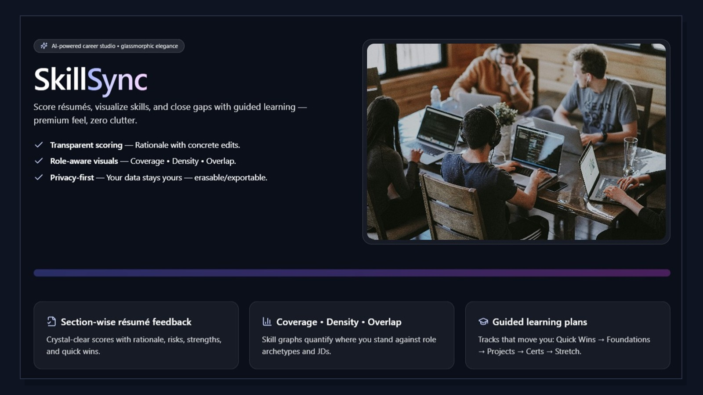
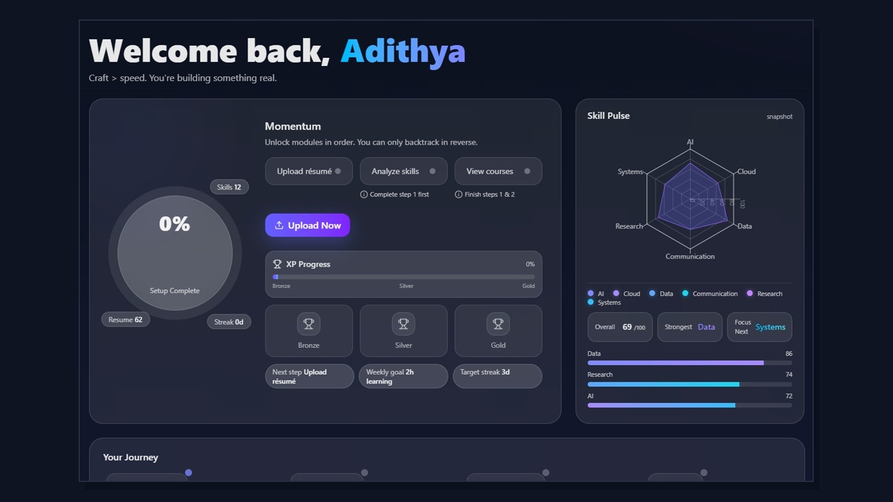
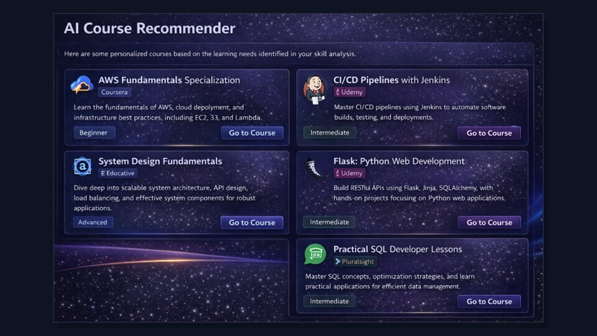
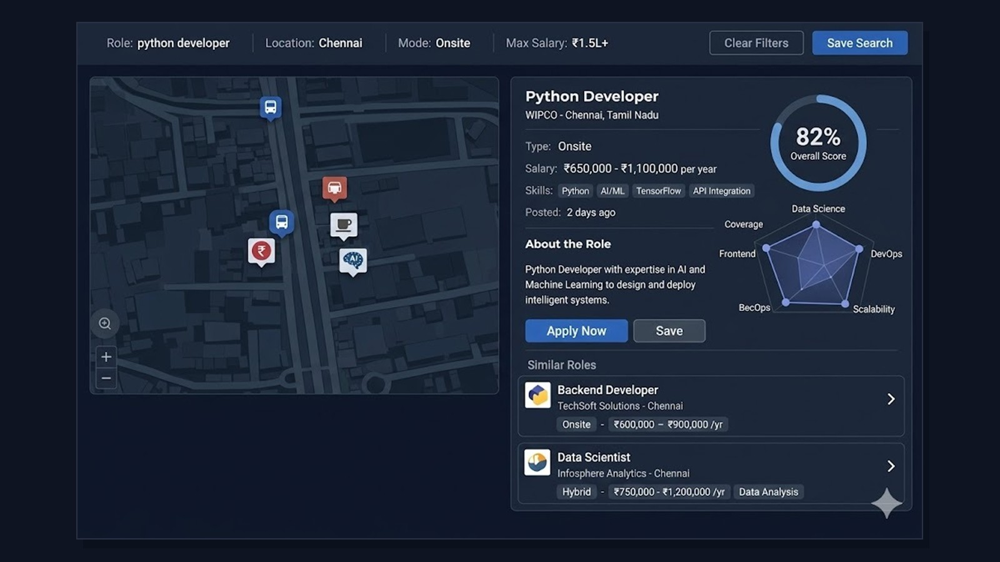

# SkillSync

SkillSync is a full-stack career intelligence platform for turning resume data into technical decision support. Rather than treating a candidate profile as a static document, the system models it as structured evidence: parse the document, recover the skills, estimate role alignment, quantify the gaps, generate a learning plan, and connect that profile to relevant opportunities.

The project combines a Next.js frontend with a FastAPI backend, feature-based scoring, semantic retrieval, lightweight machine learning, and LLM-backed reasoning. The aim is not simply to score a resume, but to make career progression computationally legible.

## What the System Covers

- Resume upload, indexing, and profile construction
- Skill extraction and normalization
- Resume scoring with interpretable feedback
- Ranked role-fit analysis
- Candidate-versus-job gap computation
- Course and learning-path recommendation
- Live job discovery with location-aware exploration
- Assistant-guided planning and follow-up support

## Architectural Walkthrough

SkillSync is best understood as a pipeline of cooperating surfaces rather than a collection of unrelated pages. The product starts by ingesting candidate evidence, transforms that evidence into a structured skill profile, uses ranking and retrieval to estimate fit, and then uses recommendation and assistant layers to turn analysis into action.

### 1. Entry and Workspace

The platform opens with a product-facing entry layer and then moves into an operational workspace for the candidate. The public-facing surface explains the system clearly; the dashboard turns that positioning into a working state model with momentum, progress, and skill pulse signals.

<p align="center">
  
</p>

<p align="center">
  
</p>

### 2. Evidence Ingestion and Fit Inference

Once a resume enters the system, SkillSync moves from document intake to evidence extraction and role inference. The upload surface exists to capture the document cleanly; the analysis layer then surfaces a ranked role-fit view with overlap, coverage, and best-fit reasoning rather than a single opaque number.

<p align="center">
  
  
</p>

### 3. Recommendation and Planning

After the system identifies fit and gaps, the next layer is prescriptive. Recommendation is not treated as a decorative extra; it is the mechanism by which the candidate can move from analysis to capability-building. In practice this means course retrieval, bucketed learning paths, and assistant-guided planning.

<p align="center">
  
  
</p>

### 4. Opportunity Exploration

The discovery layer connects profile intent back to the market. Job exploration is location-aware, fit-aware, and integrated into the same product rather than delegated to an external portal. This allows the candidate to move from internal profile analysis to external opportunity evaluation within a single workflow.

<p align="center">
  
</p>

### 5. Product Breadth

Not every route is represented as a hero image in this README, but the repository includes a broader surface area than the core walkthrough alone. The following composite view reflects that wider product footprint.

<p align="center">
  
</p>

## AI and ML System Design

SkillSync is built on a hybrid intelligence architecture. Different layers of the stack are responsible for different kinds of reasoning, which is what keeps the system both useful and explainable.

### Deterministic Processing

The base layer is intentionally non-generative.

- Resume and JD content are parsed into stable textual representations.
- Skills are normalized against curated vocabularies and canonical forms.
- Structural and lexical evidence is extracted before any narrative generation occurs.

This layer matters because it anchors downstream behavior to explicit evidence rather than prompt-only interpretation.

### Feature Engineering and Classical ML

The backend includes a concrete scoring path based on standard machine learning and information retrieval techniques.

- TF-IDF vectorization is used for text similarity and signal weighting.
- Cosine similarity is used to compare candidate text with role and job text.
- Overlap-based features such as skill overlap, skill union, and jaccard-style coverage are assembled into ranking signals.
- Title-level priors and skill-density measures are included as structured predictive features.
- `scikit-learn` supports vectorization, similarity, and feature-oriented model utilities.
- `XGBoost` supports model-assisted fit scoring and predictive ranking.

In other words, the system does not merely describe a profile; it constructs a measurable compatibility surface between candidate evidence and role requirements.

### Semantic Retrieval

Keyword overlap alone is too brittle for career inference. SkillSync addresses that with semantic retrieval.

- Sentence-transformer embeddings are used to represent skills, roles, and catalog items in vector space.
- Skill and role catalogs can therefore be queried semantically, not only by exact token match.
- This improves recovery when the same capability is expressed with different terminology across resumes, JDs, and learning resources.

### Fuzzy Matching and Gap Logic

Candidate data is frequently noisy, partial, and inconsistently phrased. The gap-analysis layer addresses that directly.

- Fuzzy matching recovers aliases, variants, and near-matches.
- Partial-similarity logic supports more useful gap computation than binary have-versus-don't-have matching.
- Gap analysis distinguishes between exact matches, partial matches, missing skills, and extra skills.

That distinction is important because the improvement path for a partially evidenced skill is very different from the path for a completely absent one.

### LLM-Backed Reasoning

LLMs are used where synthesis, explanation, and plan generation are genuinely valuable.

- role inference from resume evidence
- coaching-pack generation
- guided learning plans from computed gaps
- recommendation enrichment
- assistant conversation and follow-up support

The LLM layer is therefore interpretive rather than foundational. Core extraction, retrieval, ranking, and gap computation happen before the system asks a model to explain what the evidence implies.

### Recommendation Strategy

Recommendation is also hybrid rather than purely prompt-driven.

- courses are retrieved against target skills and normalized coverage signals
- deterministic ranking considers coverage, level-fit, time-fit, freshness, trust, and access constraints
- LLM notes can be layered on top as explanatory context

This keeps the recommendation engine grounded in retrieval logic while still allowing it to speak in a more useful planning language.

## Product and API Surface

The screenshots above focus on the main interaction loop, but the repository exposes a wider route and endpoint surface.

### Primary frontend routes

- `/dashboard`
- `/resume`
- `/upload-resume`
- `/resume-list`
- `/extract-skills`
- `/resume-score`
- `/skill-analysis`
- `/compute-gaps`
- `/course-genie`
- `/live-jobs`
- `/chat`
- `/chat-assistant`
- `/analyze-jobs`
- `/recommend`
- `/pdf-match`
- `/profile`
- `/settings`

### Selected backend workflows

- `/api/v1/llm/upload-resume`
- `/api/v1/llm/feedback/resume-score`
- `/api/v1/llm/ml/extract-skills`
- `/api/v1/llm/match`
- `/api/v1/llm/ml/compute-gaps`
- `/api/v1/llm/ml/recommend`
- `/api/v1/llm/analyze-jobs`
- `/api/v1/jobfeed/feed`
- `/api/v1/llm/prompt`

Together, these routes form a single pipeline: ingest, analyze, score, compare, recommend, and explore.

## System Structure

- `frontend/` contains the user-facing application: dashboard, analysis flows, recommendation pages, job exploration, and assistant interfaces.
- `backend/app/api/` exposes the operational REST surface for upload, scoring, matching, recommendation, and retrieval workflows.
- `backend/app/ml/` contains embeddings, catalog search, gap computation, recommendation logic, and semantic matching helpers.
- `backend/app/services/` contains feature engineering, model-serving utilities, resume feedback logic, job retrieval helpers, and LLM clients.
- `backend/app/llm_api/` contains reasoning-heavy routes for coaching, role inference, and plan generation.
- `backend/app/models/` packages the fitted artifacts used by the ML-assisted path.
- `db/seeds/` contains lightweight seed data for repeatable local setup.
- `screenshots/` contains the public product imagery used in this README.

```text
Resume / JD input
  -> parsing + normalization
  -> taxonomy-aware skill extraction
  -> feature engineering + semantic retrieval
  -> scoring / ranking / gap computation
  -> recommendation and plan generation
  -> exploration and assistant-guided action
```

## Technology Stack

- Frontend: Next.js, React, TypeScript, Tailwind CSS, Framer Motion
- Backend: FastAPI, Pydantic, NumPy, Pandas, scikit-learn, XGBoost
- Matching and retrieval: sentence-transformers, TF-IDF, fuzzy matching, taxonomy-guided normalization
- Integrations: Supabase, Chutes-compatible LLM endpoints, Adzuna job feed
- Data assets: packaged model artifacts, role catalogs, skill taxonomies, and seed datasets

## Repository Layout

```text
.
|-- frontend/      # Next.js product application
|-- backend/       # FastAPI services, ML helpers, and LLM routes
|-- db/            # local seed data and setup helpers
|-- screenshots/   # README product imagery
`-- README.md
```

## Local Development

### Frontend

```bash
cd frontend
cp .env.example .env.local
npm install
npm run dev
```

The frontend defaults to `http://127.0.0.1:8000` for backend API calls.

### Backend

```bash
cd backend
cp .env.example .env
python -m venv .venv
.venv\Scripts\activate
pip install -r requirements.txt
uvicorn app.main:app --reload --port 8000
```

Local API documentation:

```text
http://127.0.0.1:8000/api/v1/docs
```

## Environment Notes

- `NEXT_PUBLIC_SUPABASE_URL` and `NEXT_PUBLIC_SUPABASE_ANON_KEY` support auth-facing flows.
- `CHUTES_*` variables enable LLM-backed guidance, recommendation, and assistant routes.
- `ADZUNA_APP_ID` and `ADZUNA_APP_KEY` enable live job discovery.
- Jobfeed enrichment can be paired with local geocoding and location-enrichment toggles during development.

## Closing Note

SkillSync is designed as a technical bridge between candidate evidence and career action. Its value is not only in extracting signals from resumes or generating polished recommendations, but in making the reasoning process visible: what the system detected, how fit was estimated, where gaps remain, and which next steps are likely to produce the highest return.

As a repository, it represents a practical synthesis of frontend product design, applied machine learning, semantic retrieval, and LLM-assisted guidance. As a platform concept, it is an attempt to make career development less opaque and more computationally interpretable.
