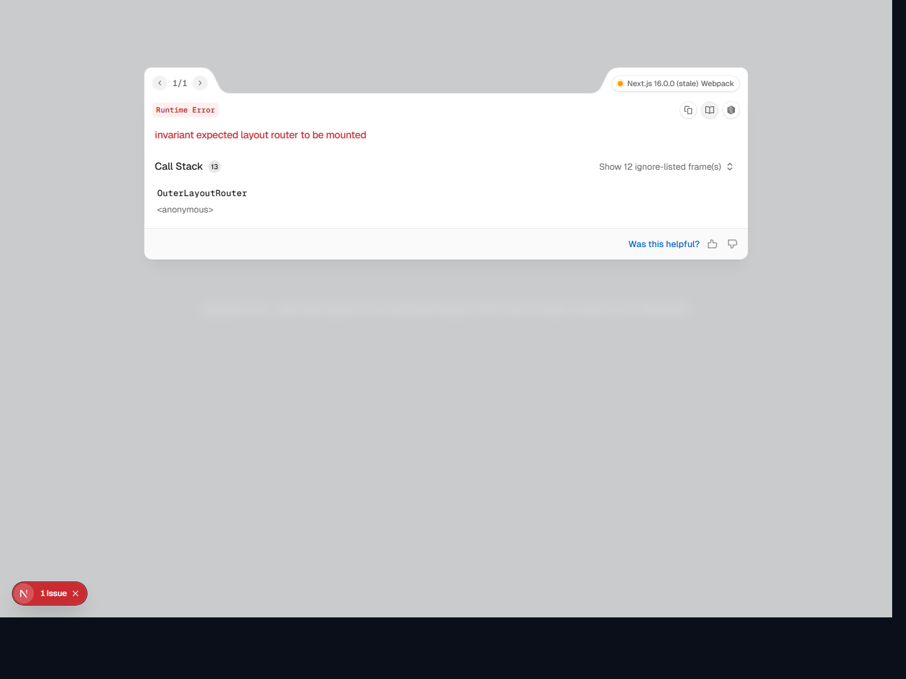

# SkillSync

SkillSync is a full-stack career intelligence platform for students and early-career engineers who need more than a resume checker and less than a bloated job portal. It turns resumes, job descriptions, and market signals into concrete next actions: score the profile, extract skills, measure role fit, compute gaps, recommend learning paths, and surface relevant opportunities in one product flow.

Built with a Next.js frontend and a FastAPI backend, the project combines deterministic parsing, lightweight machine learning, semantic matching, and LLM-assisted guidance to make career navigation feel analytical instead of vague.

## Why SkillSync

- Resume feedback should be explainable, not mystical.
- Skill intelligence should be tied to roles, not generic keyword dumps.
- Gap analysis should lead to an actionable plan, not a dead-end score.
- Job discovery should connect profile fit, geography, and momentum in a single workflow.

## Product Surface

- Resume upload, indexing, and profile extraction
- Skill extraction with grouped outputs and long-tail skill surfacing
- Resume score and structured feedback
- Skill Analysis with ranked best-fit roles and match reasoning
- Compute Gaps for candidate-versus-job comparison
- Course Genie and guided learning tracks
- Live Jobs with location-aware discovery and map-based browsing
- AI chat and recommendation flows for planning next moves

## Product Views

The public repo is organized so the screenshot gallery can be refreshed without changing the README structure. The visual direction is consistent across the app: dark glass panels, technical dashboards, role-fit analytics, and guided action flows.

<p align="center">
  
  
</p>

<p align="center">
  
  
</p>

## AI + ML Core

SkillSync is not just a UI wrapper around prompts. The backend uses a hybrid intelligence pipeline that mixes deterministic logic, classic ML, semantic retrieval, and LLM enrichment.

- Deterministic parsing extracts text from resumes and job descriptions, normalizes skills, and preserves a stable scoring path.
- TF-IDF-style ranking and frequency heuristics provide robust term extraction even when richer models are unavailable.
- Sentence-transformer embeddings support semantic lookup across skill catalogs and role catalogs for better matching than raw keyword overlap.
- RapidFuzz-style fuzzy matching helps recover near-matches, aliases, misspellings, and partially expressed skills.
- scikit-learn and XGBoost are part of the backend stack for model-assisted ranking and structured scoring workflows.
- LLM routes are used where generative reasoning actually adds value: coaching packs, role-fit narratives, guided learning plans, chat, and enriched recommendations.
- The practical design principle is hybrid AI: deterministic where correctness matters, ML where ranking matters, and LLMs where explanation and guidance matter.

## System Design

- `frontend/` contains the product experience: landing, dashboard, resume workflows, skill analysis, course planning, job exploration, and chat.
- `backend/app/` exposes the API surface for scoring, matching, gap computation, recommendation, and jobfeed retrieval.
- `backend/app/ml/` houses semantic matching, embeddings, gap logic, and catalog-aware ML helpers.
- `backend/app/llm_api/` contains the LLM-facing routes used for coaching, recommendations, and narrative enrichment.
- `backend/app/models/` ships fitted artifacts and packaged model data used by the ML-assisted matching path.
- `db/seeds/` provides lightweight local seed data without leaking internal workspace noise.

## Architecture Snapshot

```text
Resume / JD input
  -> parsing + normalization
  -> skill extraction + term ranking
  -> semantic matching / fuzzy recovery
  -> scoring + gap computation
  -> LLM enrichment / learning guidance
  -> frontend visualizations + job exploration
```

## Stack

- Frontend: Next.js, React, TypeScript, Tailwind CSS, Framer Motion
- Backend: FastAPI, Pydantic, NumPy, Pandas, scikit-learn, XGBoost
- NLP / matching: sentence-transformers, fuzzy matching, taxonomy-driven skill normalization
- Integrations: Supabase, Chutes-compatible LLM endpoints, Adzuna job feed
- Data assets: packaged model artifacts, curated seed data, role and skill catalogs

## Repository Layout

```text
.
|-- frontend/   # Next.js product UI
|-- backend/    # FastAPI API + ML / LLM services
|-- db/         # seed data and local db helpers
`-- docs/       # screenshots and supporting assets
```

## Local Setup

### 1. Frontend

```bash
cd frontend
cp .env.example .env.local
npm install
npm run dev
```

The frontend defaults to `http://127.0.0.1:8000` for backend API calls.

### 2. Backend

```bash
cd backend
cp .env.example .env
python -m venv .venv
.venv\Scripts\activate
pip install -r requirements.txt
uvicorn app.main:app --reload --port 8000
```

Local API docs are exposed at:

```text
http://127.0.0.1:8000/api/v1/docs
```

## Environment Notes

- `NEXT_PUBLIC_SUPABASE_URL` and `NEXT_PUBLIC_SUPABASE_ANON_KEY` are required for auth-facing flows.
- `CHUTES_*` variables enable LLM-backed guidance, coaching, and recommendation routes.
- `ADZUNA_APP_ID` and `ADZUNA_APP_KEY` enable live job discovery.
- Jobfeed enrichment can optionally use location enrichment and geocoding toggles in local development.

## Public Repo Curation

This public repository is intentionally curated.

- No secret-bearing `.env` files
- No uploaded resumes or local user documents
- No repair scripts, backup trees, dumps, or one-off workspace debris
- No private caches, generated runtime clutter, or machine-specific setup artifacts
- Clear separation between product code, backend services, and local seed data

## Positioning

SkillSync is designed as an engineering-first career platform: part resume intelligence engine, part skill graph explorer, part recommendation system, and part applied AI assistant. The goal is not just to analyze a profile, but to help a candidate understand where they stand, what they are missing, and what to do next with technical clarity.
