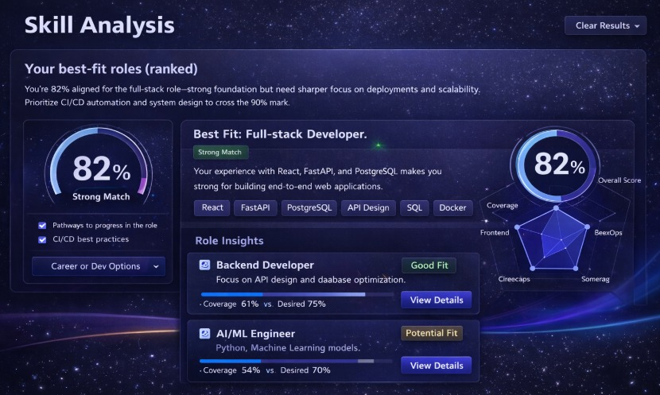
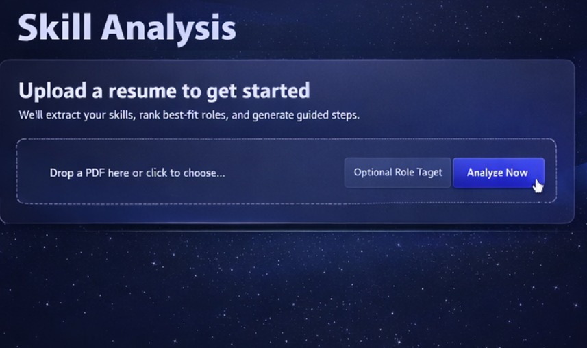
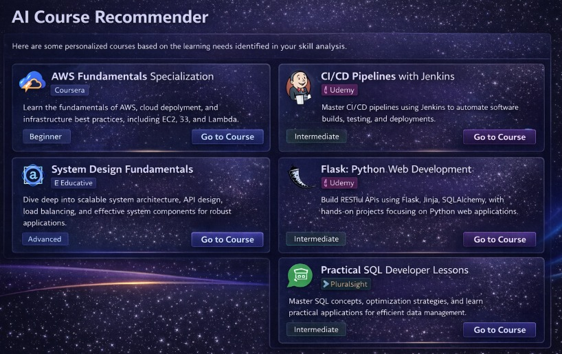
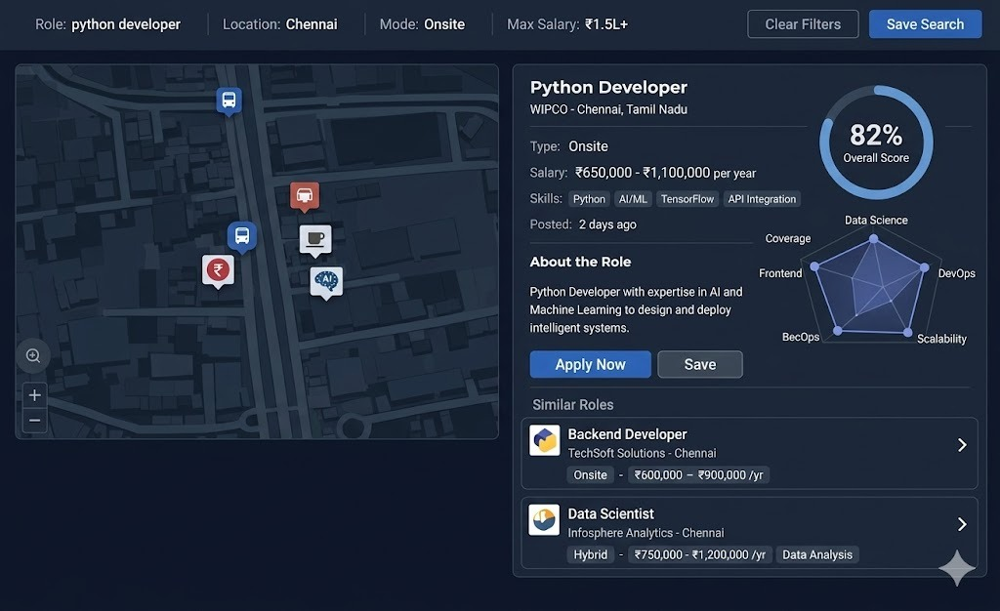
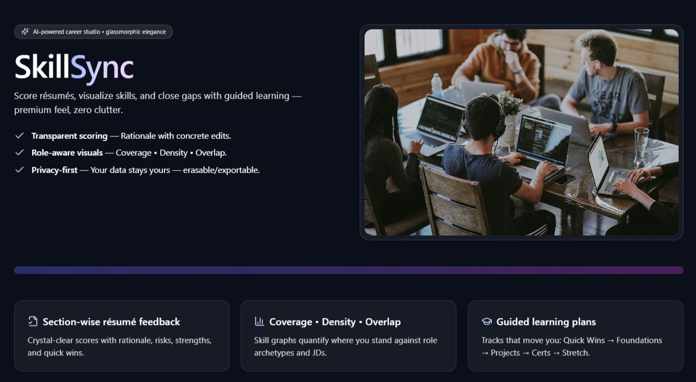
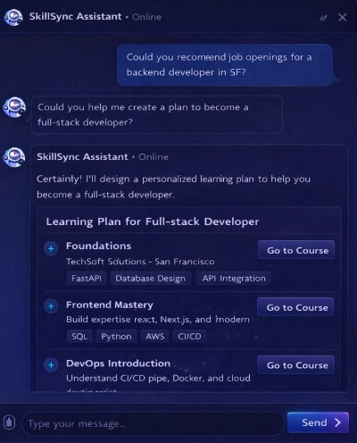
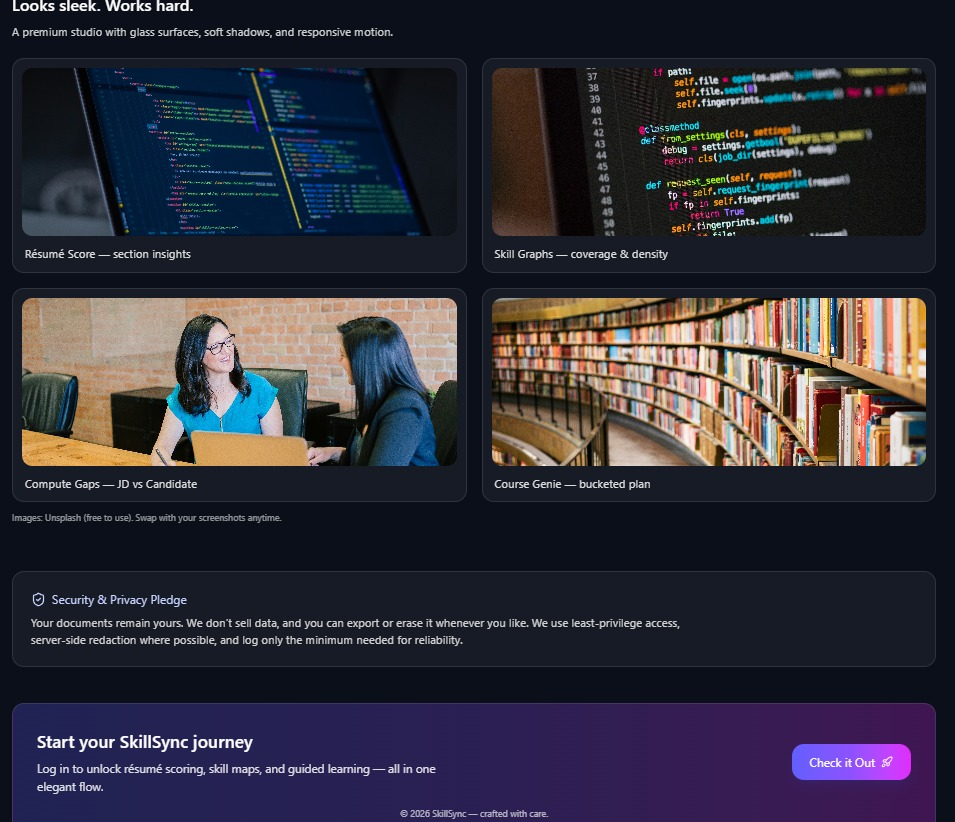
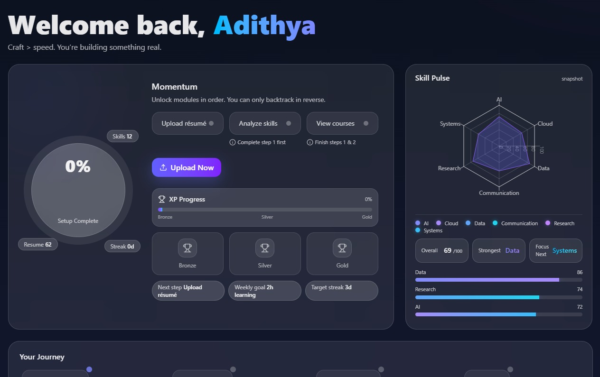

# SkillSync

SkillSync is a full-stack career intelligence system that helps candidates move from raw profile data to concrete decisions. Instead of treating a resume as a static document, the platform models it as a technical signal: extract the skills, score the profile, infer role fit, quantify the gaps, recommend learning paths, and connect the candidate to relevant opportunities.

The system combines a motion-rich Next.js frontend with a FastAPI backend, resume parsing pipelines, semantic matching, lightweight machine learning, and LLM-assisted guidance. The result is a product that is analytical in structure, practical in output, and designed to make career progression legible.

## What the Platform Does

- Scores resumes with structured, section-aware feedback
- Extracts normalized skill signals from uploaded documents
- Ranks best-fit roles and explains the match rationale
- Computes candidate-vs-job gaps with actionable next steps
- Recommends learning paths across foundations, projects, and stretch areas
- Surfaces live job opportunities with location-aware exploration
- Supports AI chat workflows for planning, coaching, and follow-up guidance

## Interface Tour

The product is organized as a connected workflow rather than a disconnected set of tools. The gallery below reflects the actual experience exposed by the public repository.

<p align="center">
  
  
</p>

<p align="center">
  
  
</p>

<p align="center">
  
  
</p>

<p align="center">
  
  
</p>

## AI + ML Design

SkillSync is not framed as an "AI wrapper." The backend uses a hybrid intelligence architecture in which deterministic systems, classical ML, semantic retrieval, and LLM reasoning each handle the part of the problem they are best suited for.

- Deterministic parsing and normalization create a stable base layer for resume and JD ingestion.
- Taxonomy-aware skill extraction reduces noisy keyword behavior and preserves role relevance.
- TF-IDF-style ranking and heuristic extraction provide robust fallback behavior for structured term discovery.
- Sentence-transformer embeddings support semantic comparisons across skills, roles, and learning catalogs.
- Fuzzy matching recovers aliases, near-matches, and imperfectly expressed skills.
- scikit-learn and XGBoost support model-assisted ranking and scoring paths where predictive structure matters.
- LLM-backed routes are reserved for higher-order reasoning tasks: coaching packs, role narratives, guided plans, recommendation enrichment, and conversational assistance.

The operating principle is straightforward: use deterministic logic for correctness, ML for ranking and retrieval, and LLMs for explanation, synthesis, and decision support.

## System Architecture

- `frontend/` contains the product UI: dashboard, resume workflows, skill analysis, gap analysis, recommendations, job exploration, and chat.
- `backend/app/api/` exposes the REST surface for scoring, upload, matching, recommendation, and retrieval flows.
- `backend/app/ml/` contains semantic matching, embeddings, gap computation, and learning-oriented ML helpers.
- `backend/app/llm_api/` contains the LLM-facing routes used for explanation and guided output generation.
- `backend/app/models/` packages fitted model artifacts used by the ML-assisted path.
- `db/seeds/` provides lightweight local seed data for reproducible setup.
- `screenshots/` contains the public product imagery used in this README.

```text
Resume / JD input
  -> extraction + normalization
  -> skill ranking + semantic matching
  -> scoring + gap computation
  -> recommendation + narrative enrichment
  -> visual analytics + guided action
```

## Technology Stack

- Frontend: Next.js, React, TypeScript, Tailwind CSS, Framer Motion
- Backend: FastAPI, Pydantic, NumPy, Pandas, scikit-learn, XGBoost
- Matching and retrieval: sentence-transformers, fuzzy matching, taxonomy-guided normalization
- Integrations: Supabase, Chutes-compatible LLM endpoints, Adzuna job feed
- Data assets: packaged model artifacts, role catalogs, skill taxonomies, and seed datasets

## Repository Layout

```text
.
|-- frontend/      # Next.js product application
|-- backend/       # FastAPI services, ML helpers, and LLM routes
|-- db/            # local seed data and setup helpers
|-- screenshots/   # README product imagery
`-- README.md
```

## Local Development

### Frontend

```bash
cd frontend
cp .env.example .env.local
npm install
npm run dev
```

The frontend defaults to `http://127.0.0.1:8000` for backend API calls.

### Backend

```bash
cd backend
cp .env.example .env
python -m venv .venv
.venv\Scripts\activate
pip install -r requirements.txt
uvicorn app.main:app --reload --port 8000
```

Local API documentation:

```text
http://127.0.0.1:8000/api/v1/docs
```

## Environment Notes

- `NEXT_PUBLIC_SUPABASE_URL` and `NEXT_PUBLIC_SUPABASE_ANON_KEY` support auth-facing flows.
- `CHUTES_*` variables enable LLM-backed guidance, recommendation, and assistant routes.
- `ADZUNA_APP_ID` and `ADZUNA_APP_KEY` enable live job discovery.
- Jobfeed enrichment can optionally be paired with local geocoding and location enrichment toggles during development.

## Public Repository Curation

This repository is intentionally cleaned for public presentation.

- No secret-bearing `.env` files
- No uploaded resumes or local personal documents
- No repair scripts, backup trees, dumps, or throwaway workspace tooling
- No machine-specific caches, `node_modules`, or runtime debris
- Clear separation between product code, backend services, data seeds, and public assets

## Positioning

SkillSync is designed as an engineering-first career platform: part resume intelligence engine, part skill graph explorer, part recommendation system, and part applied AI assistant. Its purpose is not merely to analyze a profile, but to make the candidate's current position, missing capabilities, and next highest-leverage moves technically understandable.
